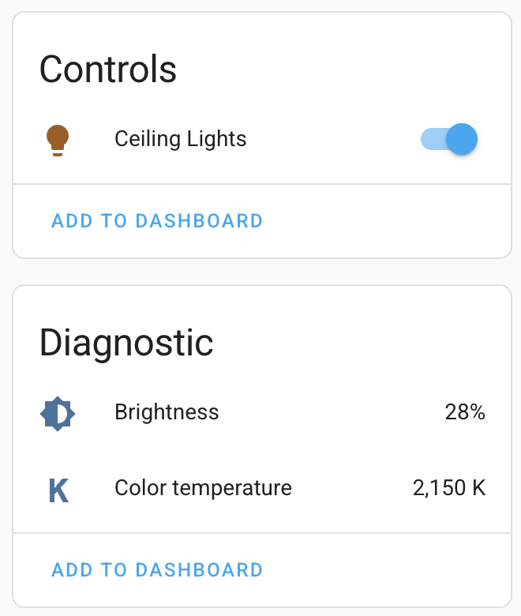
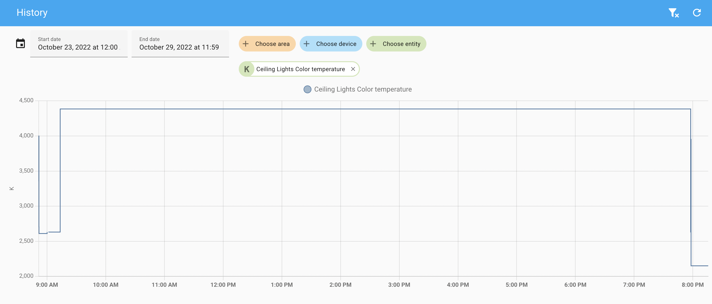
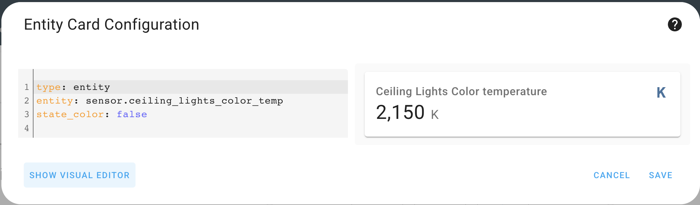

# TempLight Sensor

_Home Assistant custom integration to extract out light attributes (color temp, brightness, etc.) into separate diagnostic sensors._

- [TempLight Sensor](#templight-sensor)
  - [Overview](#overview)
  - [Installing](#installing)
  - [Configuration](#configuration)
  - [Benefits](#benefits)
    - [Save Attribute History](#save-attribute-history)
    - [Easier Automations & Frontend Views](#easier-automations--frontend-views)
    - [No More Custom Template Sensors](#no-more-custom-template-sensors)
  - [Supported Attributes](#supported-attributes)
  - [Supported Entities](#supported-entities)
  - [Naming](#naming)

## Overview

TempLight Sensors are diagonstic sensors that extract out attributes from an underlying light.
This integration creates a few derived sensors for each pre-existing `light` entity.

## Installing

1) Install HACS.
1) Add this GitHub repository as a custom repository in your HACS install.
1) Search for `TempLight Sensor` in HACS and install it.
1) Restart Home Assistant. 

All _supported_ lights in your Home Assistant install will now have diagonstic TempLight Sensors associated with them.

## Configuration

There is no configuration! TempLight Sensors are automatically added for all _supported_ lights in your Home Assistant install.

## Benefits

A few reasons these diagonstic sensors are useful:

### Save Attribute History

By default, Home Assistant does not save your lights' attributes in the database. You cannot query Home Assistant for the previous attribute values - e.g. _"How bright was my night light yesterday at 8am?"_

By extracting out these attributes to different sensors and tracking their state separately, the values are now saved to the database. You can easily view history for each individual attribute.

### Easier Automations & Frontend Views

Some frontend cards and automations do not support reading a particular attribute for a given sensor. - e.g. _Display a frontend card that shows the current color temperature of the bedroom light._

With TempLight Sensors, you can easily use these attributes, as they are now native entity state objects.

### No More Custom Template Sensors

You don't need to create your own template sensors to just extract out an attribute as state! It essentially occurs automatically now for any light you add.

## Supported Attributes

The following light attributes are extracted and stored as individual TempLight Sensors:

- `brightness`
- `color_temp`

Please file a feature request if would like to see other light attributes as sensors.

If the underying light does not support an attribute above (e.g. you have an RGB light that does not have color temperature), the sensor will still be created but show up as `Unavailable`.

If the light is turned off, all TempLight Sensors will show the last available value. They will **not** show as `Disabled` or `Unavailable`.

## Supported Entities

TempLight Sensors are automatically created for the following entities:

1) `light` entities that have a unique ID and are registered via the entity and device registry internally.

Please file a feature request if would like to see other supported entities.

## Naming

Why is this integration called **TempLight Sensor**?

It is a bit historical: To track attributes as state in Home Assistant, the common advice in the HA community forums is to create a new `template_sensor` that extracts that attribute into another sensor.

But also a play on words: Originally this integration was created to track `light` attributes. Hence `template_sensor` --> `templight_sensor`.
